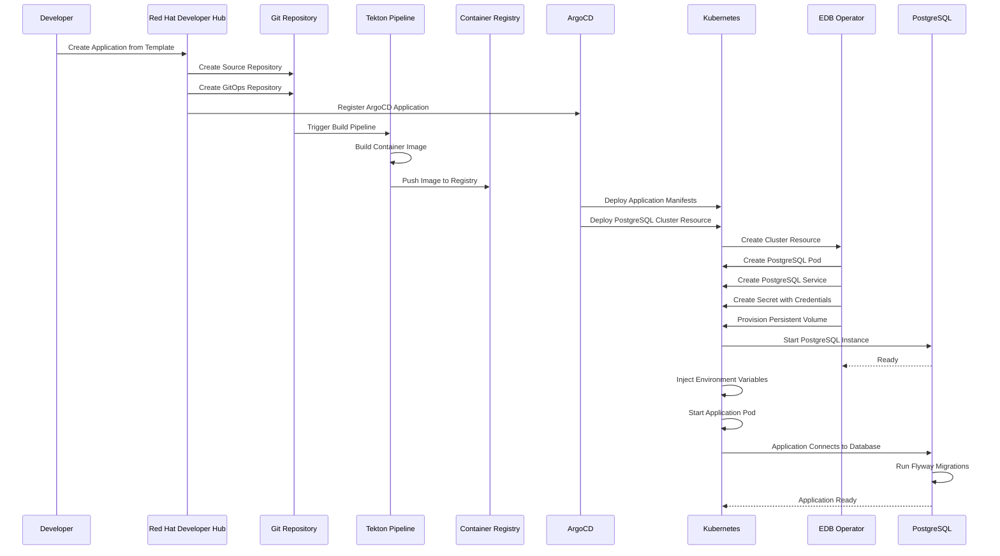
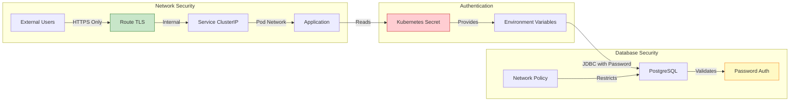
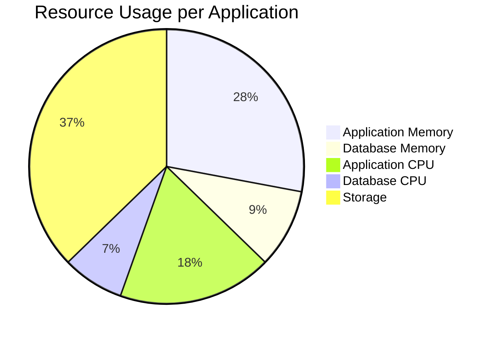

# Architecture

## Component Details

### Application Components

#### Quarkus Application
- **Type**: Java Quarkus Application
- **Runtime**: JVM (OpenJDK 11)
- **Port**: 8080
- **Resources**: 
  - CPU: 10m request / 500m limit
  - Memory: 128Mi request / 768Mi limit
- **Features**:
  - REST API endpoints
  - Database connectivity via Hibernate ORM
  - Flyway database migrations
  - Health checks

#### Service
- **Type**: Kubernetes Service (ClusterIP)
- **Port**: 8080
- **Purpose**: Internal service discovery for the application

#### Route
- **Type**: OpenShift Route
- **Protocol**: HTTPS
- **Purpose**: External access to the application
- **TLS**: Automatic certificate management

### Database Components

#### PostgreSQL Cluster
- **Type**: EDB Postgres for Kubernetes Cluster resource
- **Instances**: 1 (single instance for demo)
- **Storage**: 1Gi persistent volume
- **Resources**:
  - CPU: 50m request / 200m limit
  - Memory: 128Mi request / 256Mi limit
- **Configuration**: Optimized for minimal resource usage

#### PostgreSQL Service
- **Type**: Kubernetes Service (ClusterIP)
- **Port**: 5432
- **Purpose**: Internal database access
- **Service Name**: `<app-name>-postgresql-rw`

#### Persistent Volume
- **Type**: PersistentVolumeClaim
- **Size**: 1Gi
- **Storage Class**: ocs-external-storagecluster-ceph-rbd
- **Purpose**: Database data persistence

### Configuration Components

#### Secret
- **Name**: `<app-name>-postgresql-credentials`
- **Type**: Opaque
- **Contains**:
  - `username`: Database username (matches app name)
  - `password`: Database password
- **Managed By**: EDB Operator

#### Environment Variables
Automatically injected into the application pod:
- `QUARKUS_DATASOURCE_USERNAME`: From Secret
- `QUARKUS_DATASOURCE_PASSWORD`: From Secret
- `QUARKUS_DATASOURCE_JDBC_URL`: Auto-configured
- `QUARKUS_DATASOURCE_DB_KIND`: postgresql

### Operators

#### EDB Postgres for Kubernetes Operator
- **Version**: 1.27.1
- **CSV**: cloud-native-postgresql.v1.27.1
- **Responsibilities**:
  - Watches for Cluster resources
  - Provisions PostgreSQL instances
  - Manages database lifecycle
  - Creates and manages Secrets
  - Handles storage provisioning

### GitOps Components

#### ArgoCD Application
- **Type**: ArgoCD Application resource
- **Pattern**: App-of-Apps
- **Purpose**: Manages application deployment
- **Sync Policy**: Automated with self-healing

#### GitOps Repository
- **Contains**: Kubernetes manifests
- **Structure**:
  - `app-of-apps/`: ArgoCD application definitions
  - `components/`: Application and database manifests
  - `overlays/`: Environment-specific configurations

## Data Flow

### Application Request Flow

1. **External Request** → Route (HTTPS)
2. **Route** → Service (ClusterIP)
3. **Service** → Application Pod
4. **Application** → Processes request
5. **Database Query** → PostgreSQL Service
6. **PostgreSQL Service** → PostgreSQL Pod
7. **Response** → Application → Service → Route → Client

### Database Connection Flow

1. **Application Startup**:
   - Reads environment variables
   - Establishes JDBC connection pool
   - Runs Flyway migrations
   - Connects to PostgreSQL

2. **Runtime**:
   - Connection pool manages connections
   - Queries executed via Hibernate ORM
   - Transactions managed automatically

## Deployment Flow

## Security Architecture

## Resource Allocation

## Technology Stack

- **Application Framework**: Quarkus 2.11.3
- **Language**: Java 11
- **Database**: PostgreSQL 17.6 (via EDB Operator)
- **ORM**: Hibernate ORM with Panache
- **Migrations**: Flyway 8.5.13
- **Container Runtime**: UBI8 OpenJDK 11
- **Orchestration**: Kubernetes/OpenShift
- **GitOps**: ArgoCD
- **CI/CD**: Tekton Pipelines
- **Container Registry**: Quay.io

## Scaling Considerations

### Horizontal Scaling
- Application pods can be scaled independently
- Database is single instance (can be configured for HA)

### Vertical Scaling
- Resource limits can be adjusted in deployment manifests
- Database resources can be increased in Cluster resource

### Storage Scaling
- Persistent volumes can be expanded
- Database storage can be increased via Cluster resource

